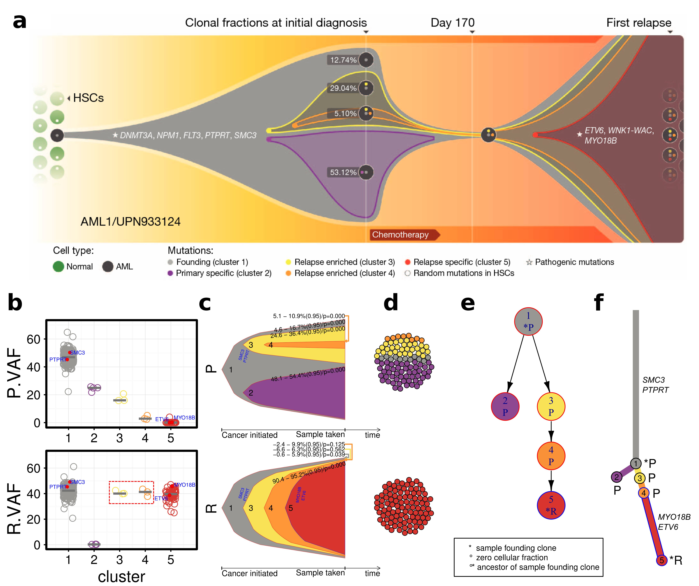

# ClonEvol
Inferring and visualizing clonal evolution in multi-sample cancer sequencing.
Code and documentation is maintained at <a href="https://github.com/hdng/clonevol">https://github.com/hdng/clonevol</a>

## What is ClonEvol?
ClonEvol is a package for clonal ordering and clonal evolution visualization. It uses the clustering of heterozygous variants identified using other tools as input to infer consensus clonal evolution trees and estimate the cancer cell fraction (also called clonal frequency) of the clones in individual samples. ClonEvol can deal with statistical uncertainty and error in sequencing and data analysis that may distort the cellular prevalence estimate of individual variants.

ClonEvol is developed at <a href="http://www.maherlab.com/">Christopher Maher laboratory</a>, <a href="http://genome.wustl.edu/">The McDonnell Genome Institute</a>, <a href="http://www.wustl.edu">Washington University in St. Louis.</a>

The following figure demonstrates the reanalysis of a relapse acute myeloid leukemia case (AML1) published in Ding et al., Nature (2012). Top panel shows the original published fishplot, and the bottom panel shows the model inferred and visualized by ClonEvol.

*Fig. 1. ClonEvol reanalysis of AML1 (a) Original model, represented by a fishplot (b-f) Matching model predicted and visualized by ClonEvol.*

## How to install and use ClonEvol?

ClonEvol code and documentation is maintained at <a href="https://github.com/hdng/clonevol">https://github.com/hdng/clonevol</a>

## How to cite ClonEvol

H. X. Dang, B. S. White, S. M. Foltz, C. A. Miller, J. Luo, R. C. Fields, C. A. Maher; ClonEvol: clonal ordering and visualization in cancer sequencing, Annals of Oncology, , mdx517, https://doi.org/10.1093/annonc/mdx517

